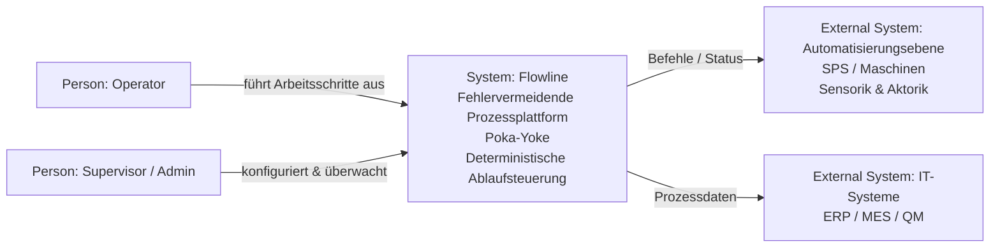
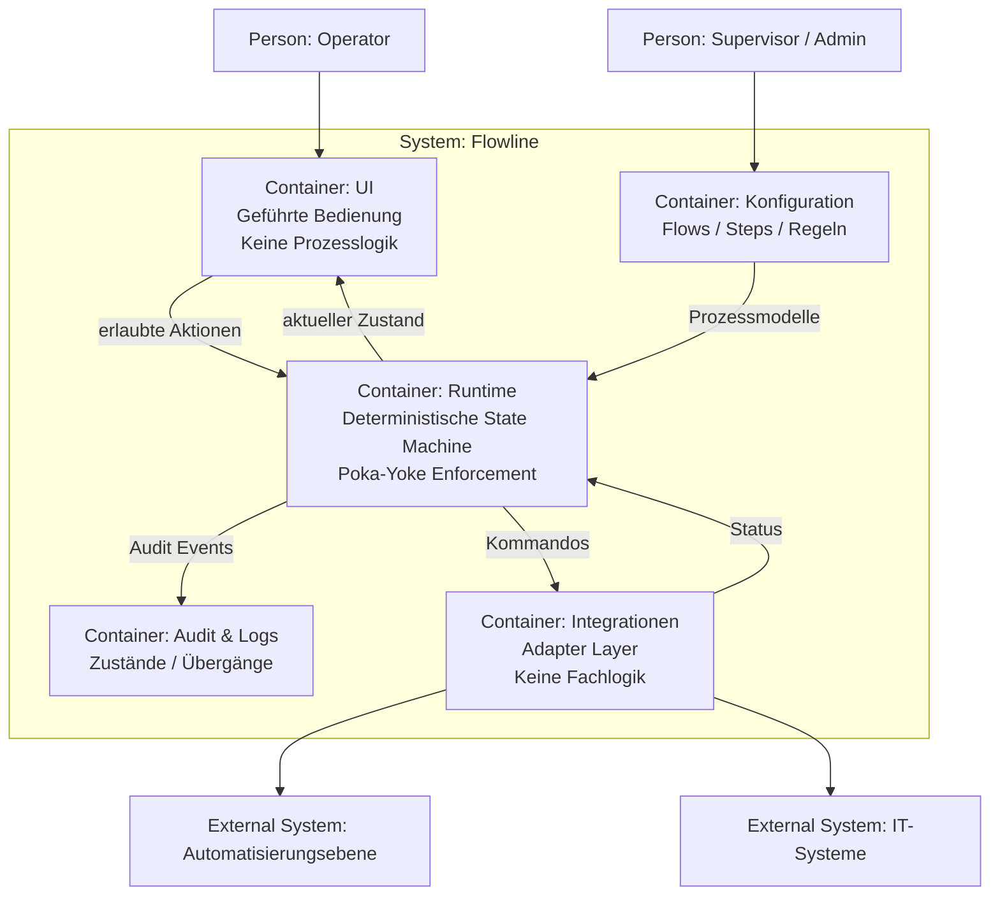

# C4-Diagramme – Flowline

Dieses Dokument enthält die **C4-System- und Container-Diagramme** für Flowline in stabiler Markdown-Form.
Die Diagramme sind konsistent zu `overview.md` (ADR 0001 & ADR 0002) und spiegeln exakt die dort festgelegten Architekturprinzipien wider.

---

## C4 – Level 1: System Context

---

## C4 – Level 2: Container

---

## Architekturregeln (aus ADR 0001 & ADR 0002)

- Die **Runtime** ist die einzige Instanz mit Prozess- und Entscheidungslogik.
- **Geführte Workflows** sind Bestandteil der Runtime (Poka-Yoke).
- Die **UI** ist rein darstellend und reaktiv.
- **Integrationen** adaptieren Technik, treffen aber keine Entscheidungen.
- **Audit & Logs** sind verpflichtend für Nachvollziehbarkeit.

---

Dieses Dokument ist Teil der offiziellen Architektur-Dokumentation von Flowline.  
Erstellt mit Unterstützung von ChatGPT und geprüft durch die Projektverantwortlichen.